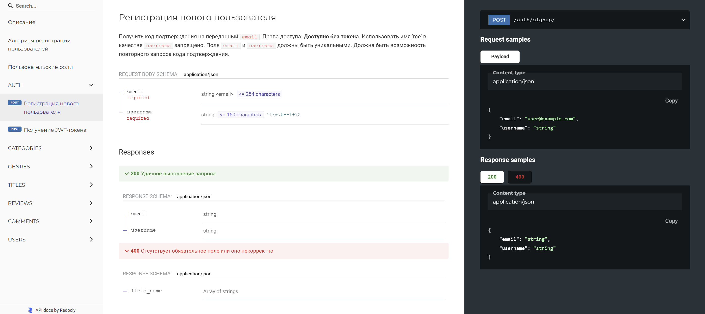
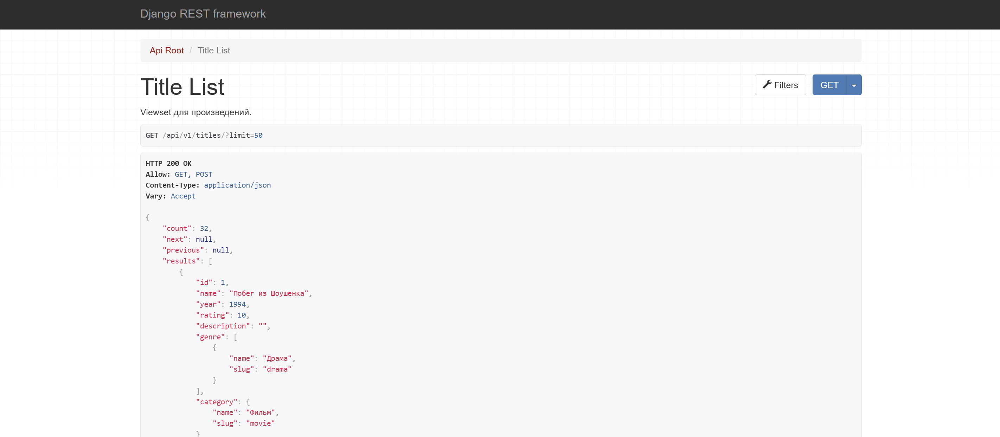
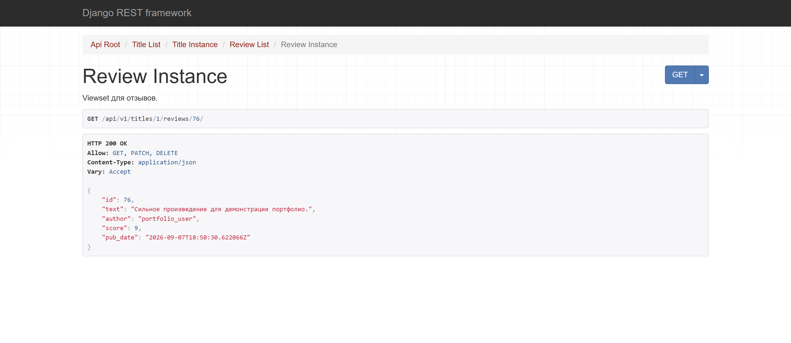

**English** | [Русский](README.ru.md)

# API YaMDb

**API YaMDb** is an educational team project built with Django REST Framework for reviewing and rating titles: books, films, music, and other categories.

Through the API, users can sign up, obtain JWT tokens, browse titles, and leave reviews and comments. The project implements user roles, filtering, title ratings, and administrative workflows.

> This repository is a fork of the team's final repository, [`psa88/api-yamdb`](https://github.com/psa88/api-yamdb). My contributions to the team implementation are documented separately below.

## My contributions

The team's pull request history records my work on the following parts of the project:

- calculating title ratings as the average of review scores;
- validating the title year to prevent creating titles dated in the future;
- returning the correct response format when creating and updating titles;
- serializing reviews according to the API schema;
- validating the relationship between `review_id` and `title_id` when handling comments;
- restricting methods for `/api/v1/users/me/`;
- disallowing the reserved username `me`;
- the user model, roles, and role helper properties;
- the signup flow and delivery of `confirmation_code`;
- confirmation code validation in `TokenSerializer` and access token issuance;
- fixes following code review, flake8 checks, and team documentation.

Related team PRs in the upstream repository:

- [`Feature/nikol-fixes` — PR #11](https://github.com/psa88/api-yamdb/pull/11);
- [`Feature/fix 1 review nikol` — PR #17](https://github.com/psa88/api-yamdb/pull/17).

## Features

- registration with `username` and `email`;
- delivery of `confirmation_code`;
- JWT authentication;
- `user`, `moderator`, and `admin` roles;
- user management through the API;
- title CRUD;
- categories and genres;
- reviews and scores from 1 to 10;
- comments on reviews;
- one review per user per title;
- automatic title ratings;
- filtering by category, genre, name, and year;
- search across reference data and users;
- pagination;
- initial data import from CSV;
- ReDoc documentation.

## Tech stack

- Python
- Django
- Django REST Framework
- Simple JWT
- django-filter
- SQLite
- pytest
- Postman

## Roles and permissions

| Role | Permissions |
| --- | --- |
| Anonymous | Read titles, categories, genres, reviews, and comments |
| `user` | Anonymous permissions + own reviews and comments |
| `moderator` | User permissions + edit/delete any reviews and comments |
| `admin` | Full management of users, categories, genres, and titles |

## Main endpoints

All API routes start with `/api/v1/`.

| Resource | Endpoint |
| --- | --- |
| Registration | `/api/v1/auth/signup/` |
| JWT | `/api/v1/auth/token/` |
| Users | `/api/v1/users/` |
| Current user | `/api/v1/users/me/` |
| Categories | `/api/v1/categories/` |
| Genres | `/api/v1/genres/` |
| Titles | `/api/v1/titles/` |
| Reviews | `/api/v1/titles/{title_id}/reviews/` |
| Comments | `/api/v1/titles/{title_id}/reviews/{review_id}/comments/` |

## API demonstration

### Documentation and user registration

ReDoc describes the available endpoints, request and response schemas, and possible API errors.



### Retrieving titles

The API returns a paginated list of titles with ratings, genres, and categories.



### Working with reviews

Reviews are available through nested title endpoints; the API supports retrieving, updating, and deleting individual reviews according to access permissions.



## Local setup

Run the commands from the root of the cloned repository. Use Python 3.12.
In Windows PowerShell, replace `source venv/bin/activate` with
`.\venv\Scripts\Activate.ps1`. Once the server starts, open http://127.0.0.1:8000/.
The server runs in the foreground; stop it with `Ctrl+C`. Run tests from the repository
root in a separate terminal with the virtual environment activated.

Clone this fork:

```bash
git clone https://github.com/nikamurkaa/api-yamdb.git
cd api-yamdb
```

Create and activate a virtual environment:

```bash
python -m venv venv
```

Windows PowerShell:

```powershell
.\venv\Scripts\Activate.ps1
```

Linux/macOS:

```bash
source venv/bin/activate
```

Install dependencies:

```bash
python -m pip install --upgrade pip
pip install -r requirements.txt
```

Prepare the database:

```bash
cd api_yamdb
python manage.py migrate
python manage.py load_csv
```

Start the server:

```bash
python manage.py runserver
```

API:

```text
http://127.0.0.1:8000/api/v1/
```

ReDoc:

```text
http://127.0.0.1:8000/redoc/
```

## Verification

From the project root:

```bash
pytest
flake8
```

The `postman_collection/` directory contains a collection for manual API testing.

The project was completed as part of the **Yandex Practicum Python Developer course**.

## Team project authors

- [Sergey Pryadko](https://github.com/psa88)
- [Nicole Zhurbenko](https://github.com/nikamurkaa)
- [Andrey Lvov](https://github.com/eternal-git-dev)
